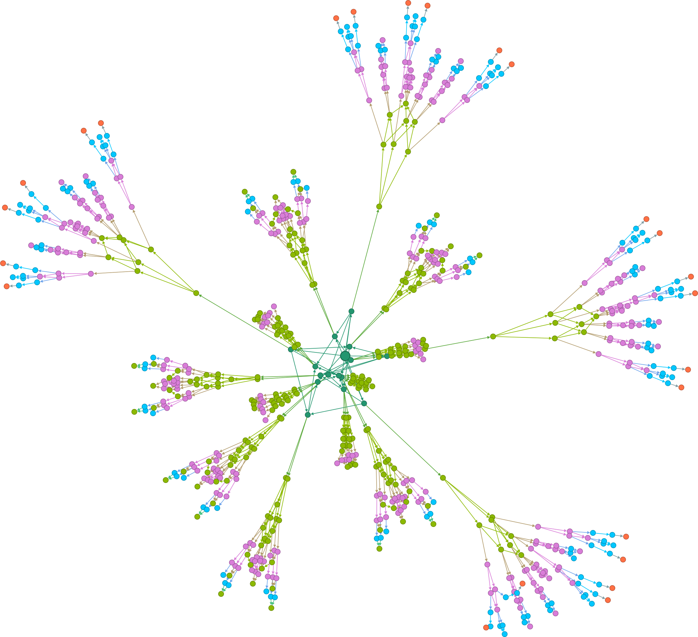

# tla-graphing-demo



This is a showcase of using tools to analyse the state graph of a TLA+ specification. 

The specification models a set of threads nonatomically incrementing a shared counter `x`. The TLA+ model checker can natively check that the end value of `x` is always a specific number or in a specific range, but it can't natively determine how likely you are to end up with each value in that range. To check that, we demonstrate extracting the full state space to a directed graph, then run a program (`likelihood.py`) to calculate the probabilities for us.

Notes on the program are in `notes.md`. There are also three other extras:

1. `clean_graph.py` utility to rename the nodes of a state graph
2. A [gephi]() model of one state space, if you want to do any visualizations
3. A [PRISM]() probabilistic model of the same system.

Information on them can be found in their corresponding folders.

# Use

## Generating state spaces

This is only necessary if you want to try modifying the spec or analyzing a state space with more than 5 threads.

1. Install the TLA+ tools (TODO)
2. Adjust the number of threads you want to model check in `threads.cfg`.
2. Run

```bash
java -jar tlatools.jar threads.tla -dump dot,actionlabels {outfile.dot}
```

This outputs a [graphviz]() file of the whole state space.

## Analyzing the state space

1\. Set up the virtualenv:

```
python -m virtualenv venv-tgd
./venv-tgd/bin/activate
python -m pip install -R requirements.txt
```

**Warning:** On Windows, `pygraphiz` might not install properly. Manually installing it with `python -m pip install --global-option=build_ext --global-option="-IC:\Program Files\Graphviz\include" --global-option="-LC:\Program Files\Graphviz\lib" pygraphviz` *seems* to work.

2\. `python likelihoods.py graph.dot`

`likelihoods.py` also has the flag `-m` for changing probabilistic weights
